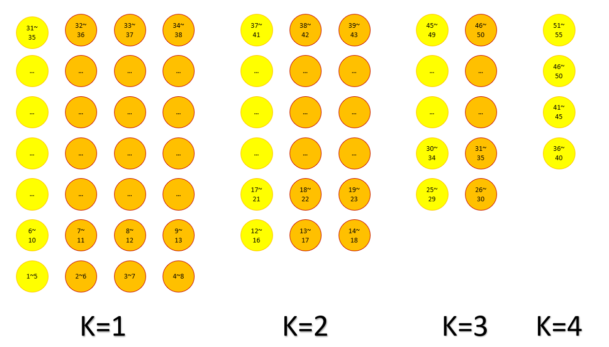

# **QR_CORDIC**
- [Introduction](#Introduction)
- [QR Decomposition & QR Cordic Algorithm](#qr-decomposition--qr-cordic-algorithm)
- [QR Cordic Hardware Design](#qr-cordic-hardware-design)
- [QR Cordic cell-base design](#Test)
- [Yolo Top works on FPGA](#Yolo-Top)
- [Simulation outcome](#OUTCOME)

## Introduction

QR 分解是數值線性代數中具備多種用途的計算工具，主要應用於線性方程、最小平方法和特徵值問題。常見的 QR 分解的計算方法包括 Householder 變換、Givens rotation以及 Gram-Schmidt 正交法。本文使用given rotation搭配CORDIC Alogorithms。
<br/>
<br/>
此文實作採用 8×4 矩陣，每個數字大小定義在 ±0.25~±1 ，預期得到一組 8×4 的上三角矩陣R。實驗流程為先使用MATLAB估算預期使用定點數(fixed point)的長度(浮點數與定點數的誤差需足夠小)以及iteration的次數，並使用delta function測量定點數與浮點數的誤差值，確保delta小於0.01，再將MATLAB生成的隨機 8×4 矩陣以定點數格式匯入verilog，並將verilog算出答案與matlab算出答案做比較，最後使用FPGA做驗證。

<p align="left">
  
</p>

<br/>

## QR Decomposition & QR Cordic Algorithm

### 1. QR Decomposition

<p align="left">
  
</p>

### 2. Given rotation

<p align="left">
  
</p>

找到角度Φ使得y’= 0，以圖一為例，a1,1為x’、a2,1為y’，找出角度Φ後，需將右側同一列的數值皆經過同樣的旋轉矩陣運算(原理同基本矩陣第二定理)，之後依序將a3,1、a4,1…變成0，直到第一行除了a1,1外均變成0。同理第二行，將a2,2為x’、 a3,2為y’進行相同動作，直到第二行除了a2,2外皆變0。持續到第n行(最後一行)，即可得到上三角矩陣R。

<p align="left">
  
</p>

### 3. Cordic

<p align="left">
  
</p>

<p align="left">
  
</p>

### 4. 8*4 qr example

<p align="left">
  
</p>

### 5. After matlab

經過matlab驗證後，得出

```
iter_num = 8
input_matrix = 13 bits(1 sign bit, 2 decimal bits, 10 fraction bits)
output_matrix = 13 bits(1 sign bit, 2 decimal bits, 10 fraction bits)
K=0.6074, total 11 bits(sign bit 1, fraction bit 10)
(derive from An, n = 8代入)
```

## QR Cordic Hardware Design

### 1. Single Assignment Form

<p align="left">
  
</p>

### 2. QR DG(dependence graph)

<p align="left">
  
</p>

<p align="left">
  
</p>

<p align="left">
  
</p>

### 4. Choose PE

原先的設計在一個clk做一次micro-rotate，但很顯然，這樣的設計執行效率過慢，因此改良後如下圖，每個cycle做2次micro-rotate(unfolding factor=2)，將提高computing latency從p+1 clock in one Given rotation變成p/2+1 clock，p為iter_num，且不改變原先的critical path(critical path仍為乘法器)

<p align="left">
  
</p>

detecting_delay_element會在PE執行完八次micro-rotation(4 cycles)後執行*K運算

### 5. Schedule

由於R22與R12間有資料相依，中間需要加delay，delay數由疊代次數(n)與J(unfolding factor)有關，算式如下：<br>
Delay >= (n/J+1)*2, n/J為 $X_{ij}$ 執行Rotation mode的次數，加1為乘法器，乘2為有兩級資料相依。 <br>
舉例：以 $X_{72}$ 、 $X_{82}$為例，R22執行需等到R12執行完 $X_{72}$、 $X_{82}$ 才能計算。同理(R13,R23)、(R14,R24)、(R34,R44)。<br>
(R23,R33)多delay兩級目的為使用pipeline技巧，讓原先需要八顆乘法器降成4顆乘法器。最後結果如下

<p align="left">
  
</p>

<p align="left">
  
</p>

以 $X_{71}$ 、 $X_{72}$ 均進入GG1開始算第一個cycle，K=1、K=4共用乘法器；K=2、K=3共用乘法器，所以一共四顆乘法器。(GG與GR的最後一個clk做乘法)

## Test

- 系統架構圖

<p align="left">
  
</p>

- QR_CORDIC輸入輸出介面


- GG輸入輸出介面


- GR輸入輸出介面


## Yolo Top

- 系統架構圖


- Top module輸入輸出介面


- Block Design


## OUTCOME

- TESBED Simulation outcome


- Timing Report


- Area


## Appendix

### waveform

1. in_valid

<p align="left">
  
</p>

2. center_control_wave

<p align="left">
  
</p>

3. out_wave

<p align="left">
  
</p>

### vivado

<p align="left">
  
</p>

<p align="left">
  
</p>


## Reference

```
[1] D. Boppana, K. Dhanoa and J. Kempa, "FPGA based embedded processing architecture for the QRD-RLS algorithm,"12th Annual IEEE Symposium on Field-Programmable Custom Computing Machines, 2004, pp. 330-331, doi: 10.1109/FCCM.2004.34

[2] ANDRAKA, Ray. A survey of CORDIC algorithms for FPGA based computers. In: Proceedings of the 1998 ACM/SIGDA sixth international symposium on Field programmable gate arrays. 1998. p. 191-200
```